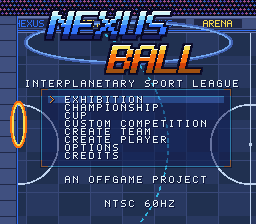
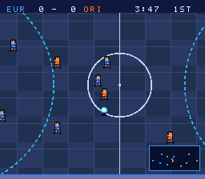
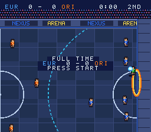
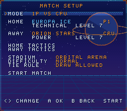
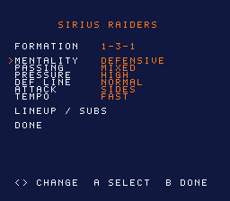
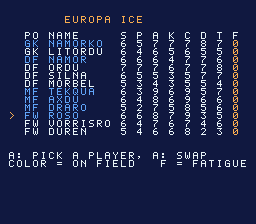
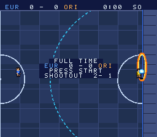
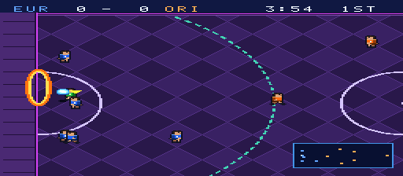
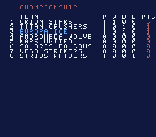
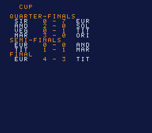

# NEXUS BALL — Super Nintendo

Jeu de sport futuriste (héritier du football et du rugby) pour **Super Nintendo / Super Famicom**,
écrit en **assembleur 65C816** natif. Projet OFFGAME, direction Jean Monos.
Cahier des charges : [`docs/cahier_des_charges_v0.2.md`](docs/cahier_des_charges_v0.2.md).

  
      

## État : Milestones 0 → 7 (gameplay, règles, tactique, présentation, compétitions)

| Élément | État |
|---|---|
| ROM HiROM FastROM 256 Kio + SRAM 32 Kio, en-tête et checksum | ✅ |
| Détection PAL/NTSC, vitesse réelle identique 50/60 Hz | ✅ |
| NMI court (OAM, BG3, palette, scroll), DMA | ✅ |
| Stade scrollable 512×320, caméra anticipée et amortie | ✅ |
| 6 vs 6 (5 joueurs de champ + gardien), formation 2-2-1 | ✅ |
| Ballon : X/Y/Z fixed-point, gravité, rebonds sol et murs, frottements | ✅ |
| Murs actifs (jeu contre le mur), anneaux verticaux, détection du but | ✅ |
| 1 point (lancer / près) — 2 points (au pied depuis la ligne longue) | ✅ |
| Passe à la main (interdite vers l'avant), passe au pied lobée, tir visé | ✅ |
| Port du ballon limité à 4 s (curseur clignotant à 3 s) | ✅ |
| Charges, duel POWER/CONTROL/DEFENSE, ballon lâché ou arraché | ✅ |
| Fautes : par derrière, gardien dans sa zone, contact tardif ; avantage ; faute grave = exclusion 20 s | ✅ |
| Gardiens IA : placement, plongeon, capter / repousser, relance | ✅ |
| IA d'équipe (soutien, pressing, zone, poursuite) à fréquence réduite | ✅ |
| Fatigue légère (sprint / STAMINA), caractéristiques 1–9 | ✅ |
| 1P vs CPU, 1P vs 2P, CPU vs CPU | ✅ |
| Horloge, mi-temps avec changement de côté, fin de match | ✅ |
| HUD compact, mini-radar ON/OFF sauvegardé en SRAM (signature, version, checksum) | ✅ |
| Menu pause (RESUME / TEAM SETUP / RADAR / QUIT MATCH), crédits | ✅ |
| Public animé (cycle de palette, s'emballe sur les actions) | ✅ |
| 16 équipes officielles (nom, monde, style, niveau, maillots domicile/extérieur, 12 joueurs) | ✅ |
| Choix des équipes, difficulté (EASY → EXPERT), règle d'égalité | ✅ |
| 6 formations (2-2-1, 2-1-2, 1-3-1, 1-2-2, 3-1-1, 3-2-0) | ✅ |
| Tactiques MENTALITY / PASSING / PRESSURE / DEF LINE / ATTACK / TEMPO, utilisées par l'IA | ✅ |
| Composition et remplacements illimités (avant match et menu pause), fatigue par joueur | ✅ |
| Prolongation 2 min en but en or, puis tirs au but (3 + mort subite) | ✅ |
| 6 stades (Orbital Arena, Mars Dome, Europa Ice, Andromeda Prime, Titan Industrial, Solaris Arena), même géométrie | ✅ |
| Audio SPC700 : pilote maison, échantillons BRR générés, effets (frappe, passe, rebond, sifflet, charge, arrêt, clameur), ambiance du public, musique de titre, jingle de fin | ✅ |
| Menu principal EXHIBITION / CHAMPIONSHIP / CUP / CUSTOM COMPETITION / OPTIONS / CREDITS | ✅ |
| Championship (ligue 3 à 16 équipes, aller simple, 3/1/0 pts, départage différence puis points marqués) | ✅ |
| Cup 4 / 8 / 16 équipes, tirage au sort, prolongation + tirs au but, tableau | ✅ |
| Custom Competition (ligue ou coupe), équipes CPU / P1 / P2, durée, difficulté, stade fixe ou rotation | ✅ |
| Matchs CPU contre CPU simulés instantanément, écran d'avant-match, champion | ✅ |
| Sauvegarde / reprise des 3 compétitions en SRAM (en-tête, version, longueur, checksum) | ✅ |
| Create Player / Create Team, équipes personnalisées | ⏳ Milestone 8 |

Graphismes temporaires générés (lisibles, contraste bleu/orange) — les graphismes finaux viendront au milestone 6.

## Commandes

| Bouton | Avec ballon | Sans ballon |
|---|---|---|
| D-pad | déplacement 8 directions | déplacement |
| **B** | passe à la main (latérale / en retrait) | — |
| **X** | passe au pied vers un coéquipier dans l'axe, sinon frappe | — |
| **Y** | tir vers l'anneau (lancer près, frappe au pied loin ; haut/bas = côté visé) | saut |
| **A** | esquive | charge |
| **L** | — | changer de joueur |
| **R** | sprint (fatigue) | sprint |
| **START** | pause | pause |
| **SELECT** (pause) | radar ON/OFF | |

## Construire

Prérequis : `cc65` (ca65 / ld65) et `python3` (sans module externe).

```sh
./build.sh
```

Produit `build/nexusball.sfc` (en-tête Europe) et `build/nexusball_ntsc.sfc` (en-tête USA).
Le code est identique : la console / l'émulateur est détecté au démarrage (`STAT78`).
Les ROMs construites sont aussi versionnées dans `build/` pour être testées directement.

## Organisation

```
include/   registres, constantes, constantes de région (region.inc), carte mémoire, macros
src/       main.asm (inclut tous les modules), boot, nmi, video, input, math, region, text,
           save, menu, ui, comp, match, shootout, audio, formation, player, ball, goalkeeper, ai, rules,
           camera, hud, sprites, teams
tools/     gfx.py (stades, sprites, police, tables), teams.py (équipes), sched.py (calendriers), spc.py (assembleur
           SPC700 + pilote audio + BRR), checksum.py,
           lrtest.py (banc de test headless libretro), fixbranch.py (outil de dev)
data/gen/  données générées (non versionnées)
docs/      cahier des charges, référence visuelle, captures
```

### Choix techniques

- **Coordonnées** : 12.4 fixed-point (16 = 1 pixel), hauteur Z 12.4, vitesse verticale en 1/64 px.
- **50/60 Hz** : toutes les vitesses / accélérations sont dans `include/region.inc` en unités NTSC ;
  la table PAL est calculée à l'assemblage (×6/5 pour les vitesses, ×36/25 pour les accélérations)
  et copiée en WRAM au boot. Les timers sont en « tu » (1/300 s) : NTSC retire 5 tu par frame,
  PAL 6 ; un match de 4 minutes dure 4 minutes dans les deux régions.
- **IA** sans triche : elle produit des directions manette (`p_want`) et des boutons (`p_act`)
  comme un joueur humain ; décisions toutes les ~0,15 s, mouvement chaque frame.
- **OAM** : entités triées par profondeur chaque frame, ~30 sprites au plus, aucune frame en retard
  mesurée sur bsnes (précision) en NTSC comme en PAL.
- **Mémoire** : toutes les variables tiennent dans $0000-$1BFF (DB = $80, code en FastROM).

## Tests headless

`tools/lrtest.py` charge un cœur libretro (snes9x ou bsnes) et exécute un script
(attente, boutons, captures PNG, lecture de la WRAM par nom de symbole) :

```sh
python3 tools/lrtest.py /chemin/snes9x_libretro.so build/nexusball_ntsc.sfc \
  "w 30; p D 2; w 4; p D 2; w 4; p STA 2; t 30000 m_state; m score 4; s fin" /tmp/test
```

(`dbg_fouls`, `dbg_turnovers`, `dbg_late`, `dbg_gkzone` sont des compteurs lus par ces tests.)
